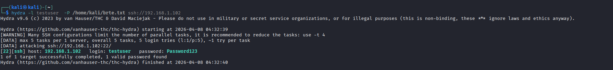
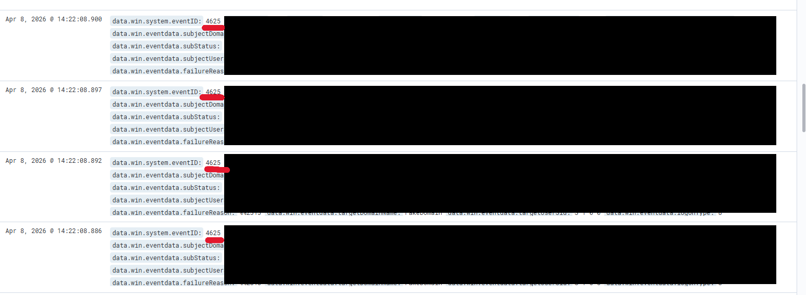

# 🔴 Brute Force Attack 

## 📌 Overview

In this stage, a brute force attack was simulated against the SSH service on the Windows target machine using Hydra.

The objective was to gain initial access by guessing the user password and observe how such activity is detected using logs.

---

## 🎯 Objective

- Simulate a brute force login attack  
- Identify weak credentials  
- Analyze logs generated during the attack  
- Detect activity using Wazuh  

---

## ⚙️ Lab Setup

- Attacker Machine: Kali Linux  
- Target Machine: Windows (SSH enabled)  
- Username: testuser  
- Tool Used: Hydra  

---

## ⚔️ Attack Execution

The attack was performed using Hydra, a password cracking tool.

### 🔹 Command Used

``` bash
hydra -l testuser -P /home/kali/brte.txt ssh://<IP>
```

### 🔹 Explanation

- `-l testuser` → target username  
- `-P brte.txt` → password list  
- `ssh://<IP>` → target IP and service  

---


---

## ✅ Attack Result

The correct password was successfully discovered:

correct password was successfully discovered:


login: testuser password: Password123


This confirms that weak passwords can be easily compromised using brute force techniques.

---



---

## ⚠️ Additional Observation

When attempting the attack using a larger wordlist (`rockyou.txt`), the SSH service started rejecting connections.

Error observed: 
[ERROR] too many connection errors


This indicates that the system applies basic protection such as:

- Rate limiting  
- Temporary blocking  

---

## 📊 Log Analysis

### 🪟 Windows Logs

During the attack, multiple failed login attempts were recorded in Windows Event Viewer.

- Event ID: **4625**
- Description: Failed login attempt  

These logs clearly indicate repeated authentication failures.

---



---

### 🛡️ Wazuh Detection

The following query was used to identify brute force activity:


data.win.system.eventID: 4625


### 🔍 Observations

- Multiple failed login attempts  
- Same username targeted  
- Same source IP repeated  
- High frequency of events  

This pattern clearly indicates a brute force attack.

---

## 🧠 Analysis

- The attack successfully demonstrated how weak credentials can be exploited  
- Even when partially blocked, brute force attempts generate detectable logs  
- Log correlation helps identify attack patterns quickly  

---

## 🧬 MITRE ATT&CK Mapping

- **T1110 — Brute Force**

---

## 🧠 Key Learnings

- Weak passwords are a major security risk  
- Repeated login failures are strong indicators of attack  
- Systems may partially block attacks but cannot hide log traces  
- SIEM tools like Wazuh help in detecting such patterns effectively  

---

## 🧾 Conclusion

A brute force attack was successfully simulated using Hydra. The attack was detected through Windows logs and Wazuh, demonstrating how authentication-based attacks can be monitored and analyzed in real-world environments.
