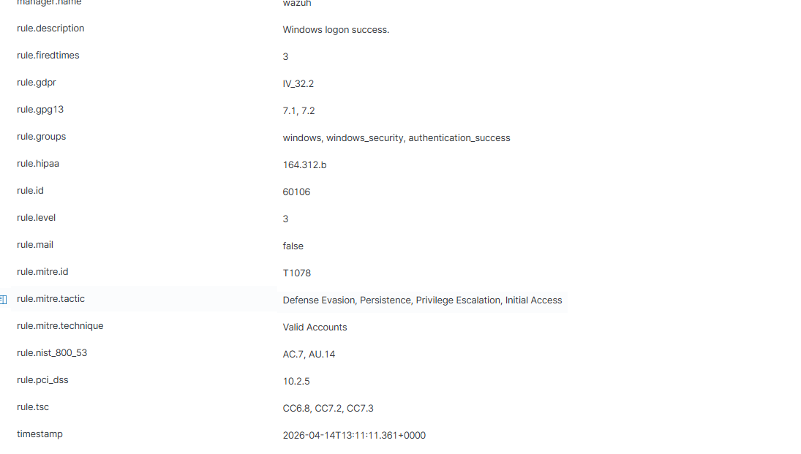
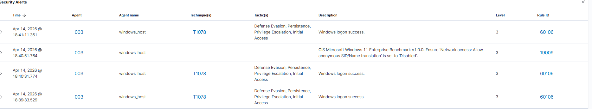

# 🔐 Incident Report — EDR Attack Simulation

---

## 📌 Overview

This project simulates a real-world cyber attack on a Windows system and analyzes detection using Sysmon and Wazuh.

The objective was to understand attacker behavior across different stages and how these activities can be detected through system logs.

---

## 🧱 Lab Environment

- Attacker Machine: Kali Linux  
- Target Machine: Windows (Sysmon + Wazuh Agent)  
- SIEM: Wazuh Server (Ubuntu)  

---

## ⚔️ Attack Timeline

| Time | Activity |
|------|---------|
| 10:00 | Brute force attack started |
| 10:03 | Password successfully cracked |
| 10:05 | Reverse shell established |
| 10:07 | Credential dumping performed |
| 10:10 | Persistence established |
| 10:12 | Logs cleared |

---

## 🔴 Stage 1 — Initial Access (Brute Force)

- Tool Used: Hydra  
- Activity: Multiple login attempts  

### 🔍 Findings

- Repeated failed login attempts  
- Event ID: **4625**  
- Successful login observed  

### 🧬 MITRE Mapping

- **T1078 — Valid Accounts**
  

---

## 🔵 Stage 2 — Execution (Reverse Shell)

- Tool Used: Metasploit  
- Activity: Payload execution  

### 🔍 Findings

- Reverse connection established  
- Meterpreter session obtained  
- Event ID: **4688 (Process Creation)**  

---

## 🟣 Stage 3 — Credential Dumping

- Tool Used: Mimikatz (Kiwi module)  
- Activity: LSASS memory access  

### 🔍 Findings

- Credentials extracted  
- Event ID: **10 (Process Access)**  

### 🧬 MITRE Mapping

- **T1003 — Credential Dumping**

---

## 🟡 Stage 4 — Persistence

- Method: Registry Run Key  
- Activity: Startup execution configured  

### 🔍 Findings

- Registry modified  
- Event ID: **13 (Registry Change)**  

### 🧬 MITRE Mapping

- **T1547 — Boot or Logon Autostart Execution**

---

## ⚫ Stage 5 — Defense Evasion

- Method: Log clearing  
- Activity: Security logs deleted  

### 🔍 Findings

- Event ID: **1102 (Log Cleared)**  

### 🧬 MITRE Mapping

- **T1070 — Indicator Removal on Host**

---

## 🛡️ Detection Summary

| Activity | Event ID |
|--------|---------|
| Failed Login | 4625 |
| Process Creation | 4688 |
| Credential Dumping | 10 |
| Registry Changes | 13 |
| Log Clearing | 1102 |

---

## ⚠️ Detection Gaps

- Some credential dumping methods were partially blocked  
- Not all events triggered automatic MITRE mapping in Wazuh  
- Detection depends on proper logging configuration  

---

## 🧠 Key Learnings

- Attack chains consist of multiple stages, not a single action  
- Logs provide visibility into attacker behavior  
- Centralized logging (Wazuh) helps retain data even after log deletion  
- MITRE ATT&CK helps classify and understand attacks  

---

## 🚀 Conclusion

This project successfully demonstrated a complete attack lifecycle and how each stage can be detected using Sysmon and Wazuh.

It highlights the importance of monitoring, log analysis, and understanding attacker techniques in real-world cybersecurity environments.

> **Note:** Some logs were not captured as screenshots during the attack simulation. The activities were verified using event IDs and Wazuh queries, and representative evidence is included.
